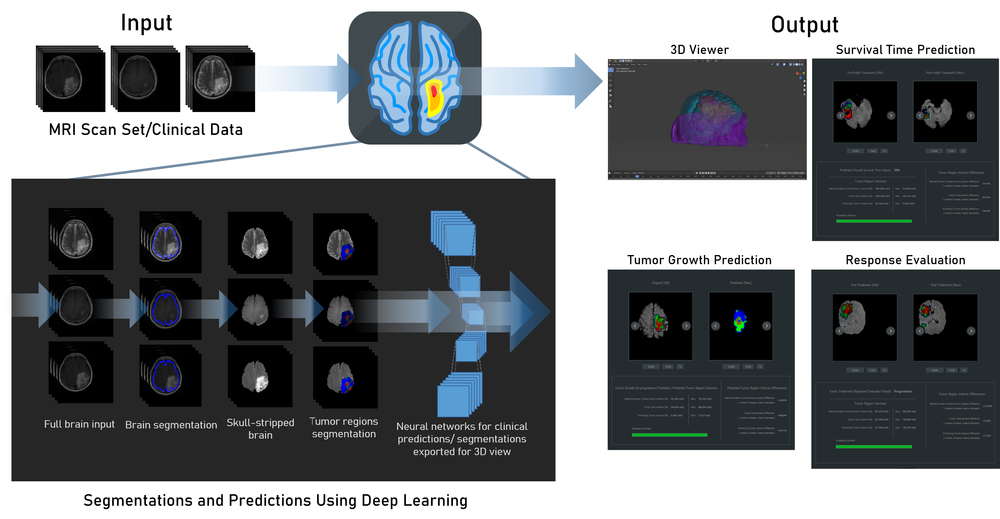
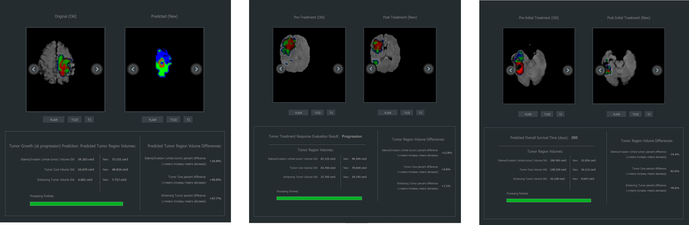
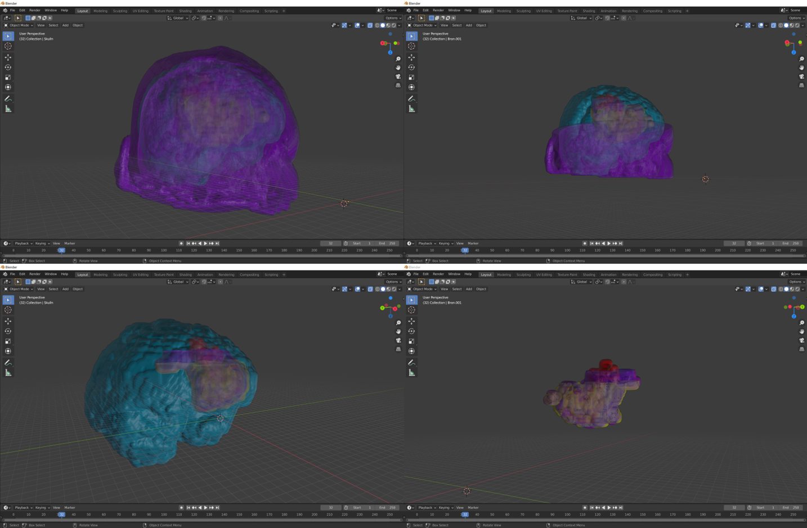

# MRImageGBM
Overall survival time predictor, Brain tumor growth (at progression) predictor, Tumor Response Evaluator and 3D MRI Viewer for Glioblastoma Brain Tumor Treatment using Deep Convolutional Neural Networks. 

MRImageGBM uses convolutional neural networks trained on extensive clinical MRI scan and patient data to provide doctors with insightful analyses of Glioblastoma MRI scans.

 

 

The user interface, written in C++ using QT creator, features the three separate functionalities as separate modules. One can upload MRI scans as a folder into the program and select the functionality of choice. The MRI scans will be passed through the trained neural networks in the background, and the resulting segmentations can be viewed in a builtin image viewer.

 

 

MRImageGBM is also implemented as a blender addon to support 3D viewing of segmented tumor volumes, with the goal in mind to be an aid for surgery planning.

 

 
